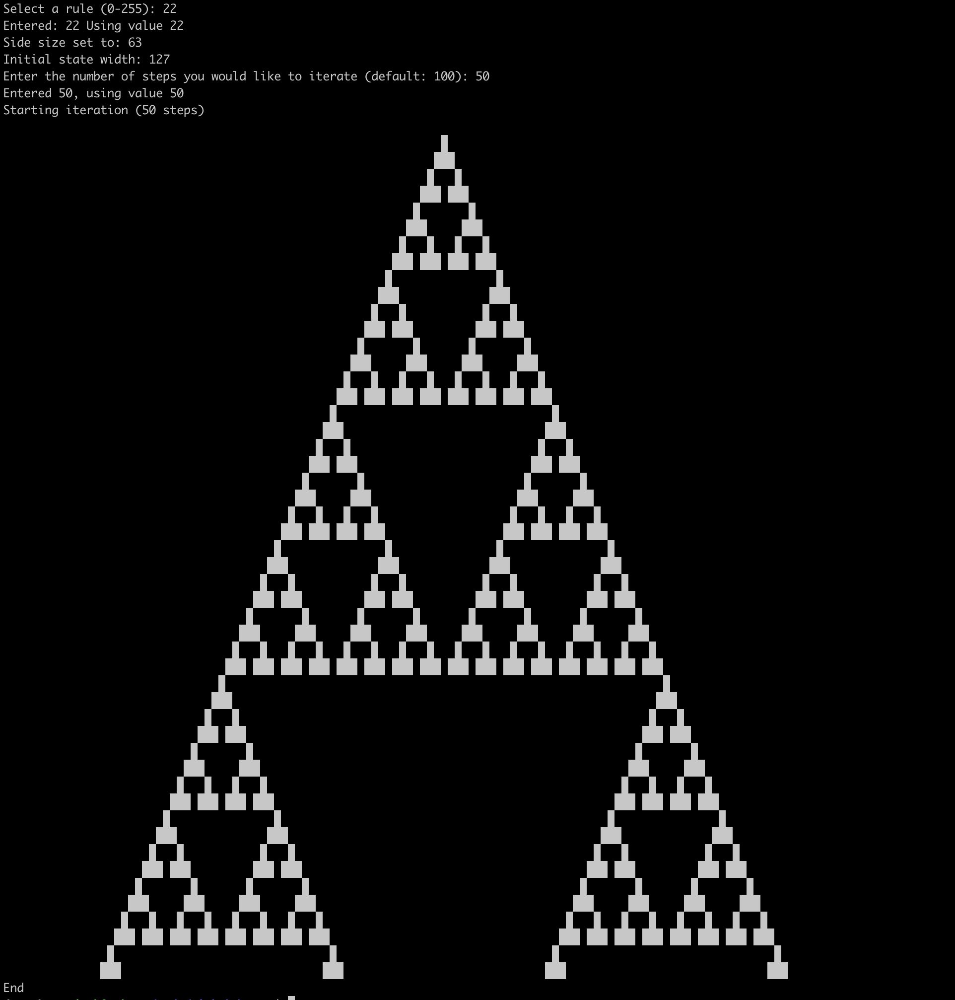

# ecapybara
ecapybara, Elementary Cellular Automata for PYthon + BARA

Iterate the 256 [elementary cellular automata](https://en.wikipedia.org/wiki/Elementary_cellular_automaton)
starting from a fixed inital state (center cell 'live', all others 'dead').

## Usage

### Console mode
`python3 ecapybara.py`


You will be prompted to select one of the rules from 0-255, and the number of steps you would like to iterate. Output will be scaled to fit the number of columns in your terminal window with some padding.

### NEW: API mode

Run locally as an API with results displayed in the browser. Non-public/non-production uses ONLY.

```
git clone git@github.com:nrejack/ecapybara.git
cd ecapybara
python3 -m venv venv  
. venv/bin/activate  
pip install -U pip flask  
flask --app eca_server run
```

 Open a browser on the machine and navigate to http://localhost:1313. 
 Select a rule (0 - 255) and number of iterations (maximum 1000), and access:
 http://localhost:1313/30/500/ to see the output in your browser.

 Example: (https://localhost:1313/30/500/)


## Sample output


## TODO
- Larger number of steps doesn't generate expected output.
- Needs to be modularized.
- Needs unit tests.
- Needs click interface for CLI.
- Needs to write images using PILlow.
- Logging needs work.

## Mascot
The official mascot of ecapybara is the e-capybara.


